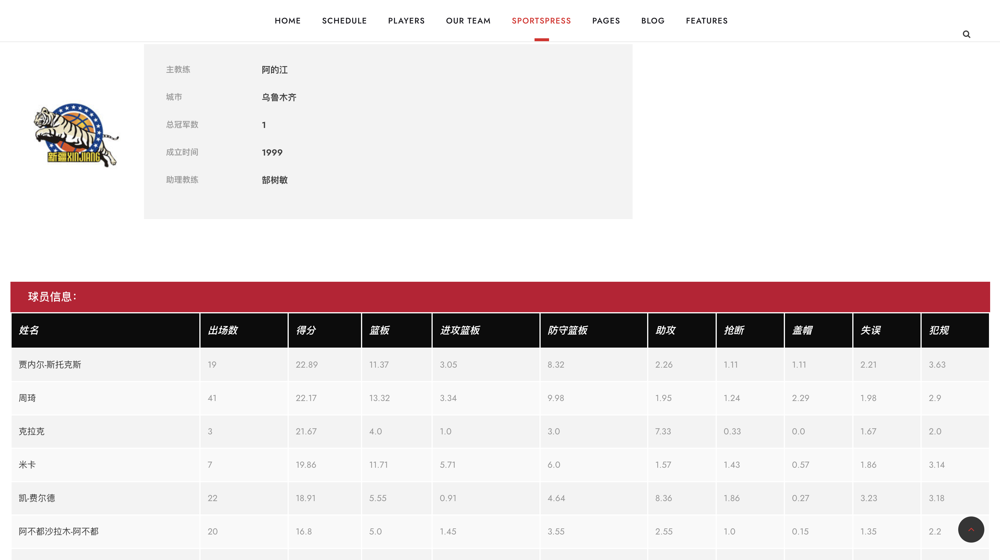
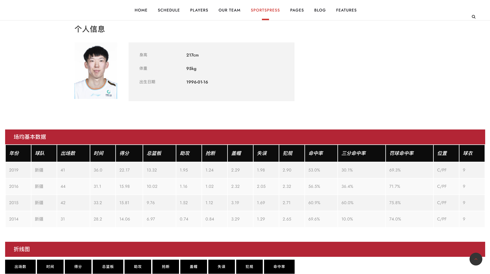
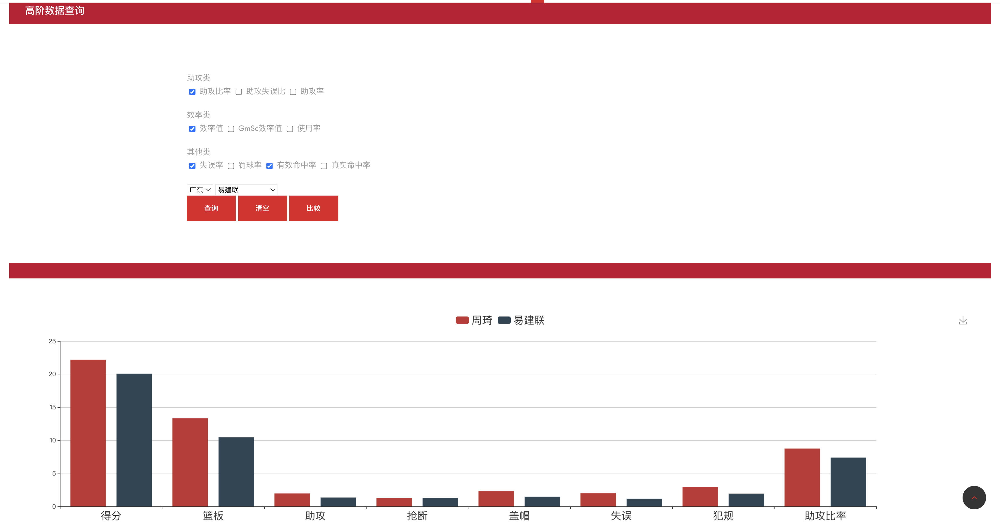

# CBA_Database
A web application for query CBA data based on flask

Final Project for the class in SJTU

All the project are running in the localhost


## Environment

### python

```shell
conda create -n CBA-env python=3.7
conda activate CBA-env

git clone https://github.com/ingra14m/CBA_Database
cd CBA-Database
pip install -r requirements.txt
```

### mysql

```shell
CREATE USER 'cba2020'@'localhost' IDENTIFIED BY 'cba2020';
GRANT ALL ON *.* TO 'cba2020'@'localhost';
```

#### import sql file

We provide the sql file in data/cba.sql

You need to add the sql file in the database named **cba2020** under the user creaded above.


### Run

Just run **src/app.py**


## Demo Representation

### Home Page


### Team Page




### Player Page




### Data Analysis

#### Basis

Made by **echarts**


#### Advanced


